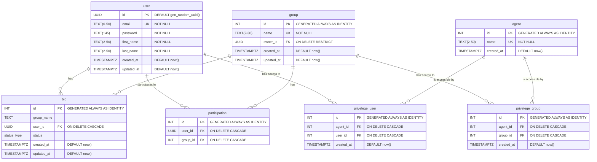
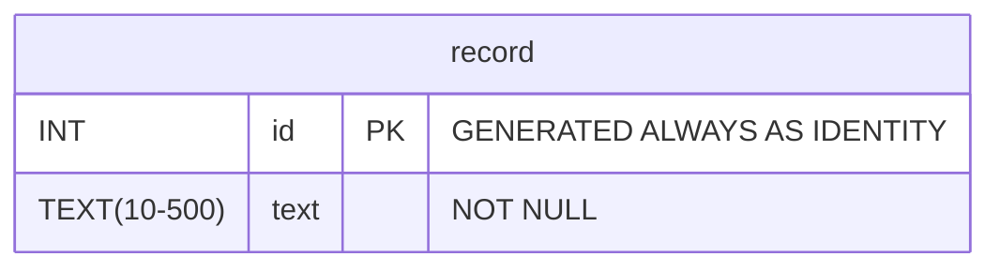

# HTTP-микросервис авторизации
Необходимо реализовать микросервис для работы с привилегиями пользователей (создание/
удаление пользователя, добавить/убрать права пользователя, проверка прав пользователя). Сервис 
должен предоставлять HTTP API и принимать/отдавать запросы/ответы в формате JSON.

## Содержание
- [Технологии](#технологии)
- [Предметная область](#предметная-область)
- [ER диаграммы](#er-диаграммы)
- [Концептуальные схемы](#концептуальные-схемы)
- [CI/CD](#ci/cd)
- [Использование](#использование)
- [API](#api)


## Технологии
- [Golang 1.23.1](https://go.dev/dl/)
- [Docker 4.31.0](https://docs.docker.com/engine/install/)
- [Viper 1.19.0](https://github.com/spf13/viper)

## Предметная область
Для микросервиса привелегий/прав пользователя я решил сделать группы с правами на использование агентов. Все права группы
наследуются ее участниками, т.е. если у группы 'devs' есть доступ к агенту с именем 'pools', то у всех участников группы 
'devs' будет доступ к агенту 'pools'. Это позволяет экономить память при хранении прав пользователей, но немного проигрывает
в cpu, так как требует join. Однако для более гибкой настройки прав пользователя была создана ручка, которая добавляет 
агента пользователю, т.е. у пользователя есть два хранилища прав - его собственное и унаследованное от всех групп, в которые он входит. В итоге доступ к агенту будет, если хотя бы в одном из хранилищ есть агента.  

В такой системе должен быть root пользователь, который будет иметь абсолютные права на все группы, агенты. Именно он создает агенты, которые используются в task_manager. Например, я написал archive_manager, к которому в начальный момент времени не имеет доступ никто, потому что информации о нем в микросервисе привелегии/прав еще нет. root пользователь должен добавить агента archive, чтобы к нему можно было обращаться. После добавления, только root имеет доступ.  

Пользователь может получить доступ к агенту 3 способами:
1) root дает прямые права пользователю на пользование агентом
2) пользователь А создает заявку на создание группы, root принимает заявку, вследствие чего создается группа с ответственным в лице пользователя А. root пользователь наделяет группу правами пользованиями услугами агента, следовательно пользователь получает доступ к агенту.
3) ответственный за группу может добавить в нее пользователя, после этого он получит права группы.

## ER диаграммы

### Микросервис прав пользователя 


### Archive manager  


## Концептуальная схема


## CI/CD
Настроен только CI: используется staticcheck и линтер, также идет проверка тестов, но тесты не успел написать, хотя опыт в написании unit-тестов есть (testify + gomock).

## Использование
Для того запустить у себя проект необходимо:
1) Установить go и docker нужных версий, также должен быть установлен клиент git.
2) Склонировать репозиторий с кодом и запустить следующие команды:
```
git clone git@github.com:cantylv/authorization-service.git
make init 
make start
```
После выполнения этих команд вы можете делать запросы, пример запросов будет ниже.

## API
Вы можете посмотреть OpenAPI [здесь](src/open-api.yaml).